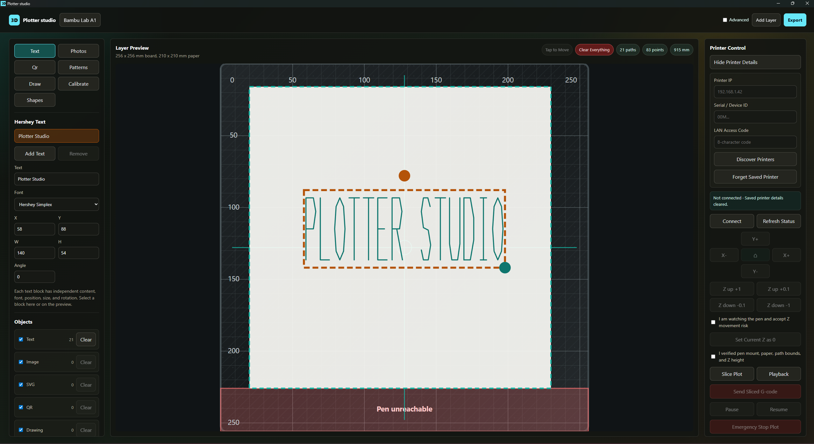
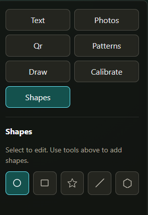
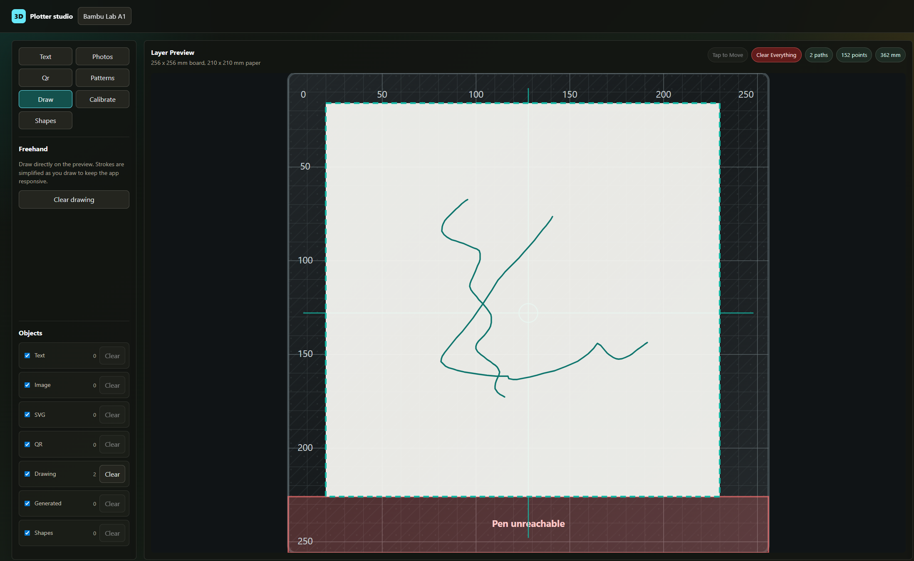
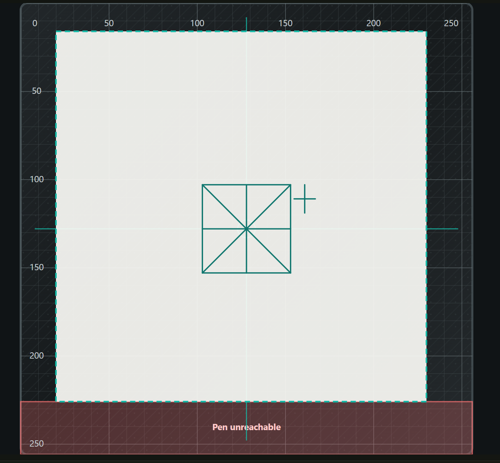
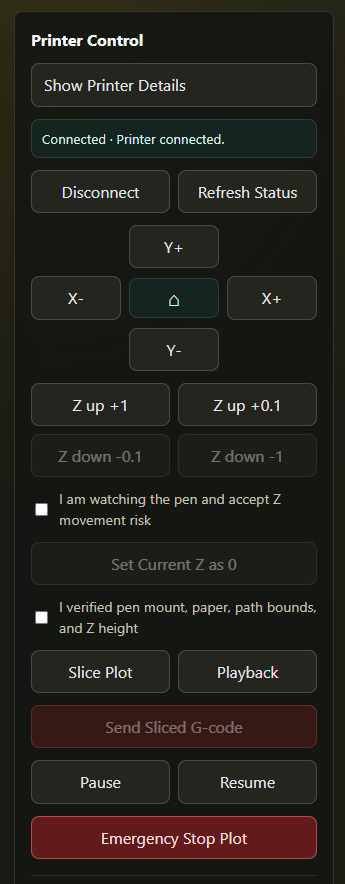

# Plotter Studio

Turn your Bambu Lab 3D printer into a precision pen plotter.

Plotter Studio is a desktop application for designing, arranging, and plotting pen-on-paper artwork using Bambu Lab 3D printers. Create text, trace images, import SVGs, generate QR codes, or draw freehand — layer them together with independent colors, then send G-code directly to your printer over Wi-Fi. No filament, no slicing, just pen on paper.

## Supported Printers

- Bambu Lab A1
- Bambu Lab A1 mini
- Bambu Lab X1 Carbon
- Bambu Lab P1S
- Any Bambu Lab printer reachable over LAN (custom board)

## Features

### Design Tools

- **Shape tools** — drag-to-create circles, rectangles, stars, hexagons, and lines with interactive move, scale, and rotate handles
- **Hershey vector text** — stroke-based fonts with multi-block support and rotation
- **Freehand drawing** — draw directly on the virtual bed with full stroke precision
- **Image tracing** — six modes: connected outline, fine outline, threshold outline, sketch, hatching, and stipple
- **SVG import** — import paths, shapes, and text from SVG files
- **QR code generator** — square, rounded, or dot module styles with fill-line support
- **Generative patterns** — hatching, crosshatch, diagonal, spiral, flow lines, and contour fills

### Printer Control

- **Tap to Move** — click anywhere on the virtual bed to position the toolhead at 1mm above Z=0
- **XY jog pad and Z jog** — fine-tune pen height and position
- **Z-zero calibration** — set pen height once and preserve it across jobs
- **Toolhead fan control** — lightweight pen-lift mechanism using the part cooling fan
- **Pause / Resume / Stop** — live control during a plot
- **Real-time printer status** — temperature, position, and progress monitoring via MQTT

### Workflow

- **Layer system** — stack multiple designs with independent colors, visibility, and ordering
- **Multi-color support** — automatic tool-change pauses between colors for manual pen swaps
- **Playback preview** — animated stroke-by-stroke preview before plotting
- **Export** — download as SVG or G-code file

### Safety

- Whitelist-based G-code validation — blocks heater and extruder commands
- Safety confirmation gates before every print
- Preserve Z-zero mode to keep calibrated pen height across jobs

## Screenshots








## Install

### Windows

Download the latest release from the [Releases](https://github.com/shahidM90/Plotter-Studio/releases) page.

1. Download **Plotter Studio Setup.exe**
2. Run the installer
3. Choose your install directory (defaults to `Program Files\Plotter Studio`)
4. Launch from the desktop shortcut or Start menu

The installer creates desktop and Start menu shortcuts, and registers a clean uninstall entry.

### From npm (any platform)

Requirements: Node.js 20 or newer.

```bash
npm install -g plotter-studio
plotter-studio server
```

The app opens at `http://127.0.0.1:5426`.

Options:

```bash
plotter-studio server --port 3000 --no-open
```

## Development

```bash
git clone https://github.com/shahidM90/Plotter-Studio.git
cd Plotter-Studio
npm install
```

### Electron app (recommended)

```bash
npm run electron:dev
```

This starts the Vite dev server and launches the Electron window. The frontend hot-reloads; restart Electron for backend changes.

### Web-only mode

In one terminal:

```bash
npm run dev
```

In a second terminal:

```bash
npm run server
```

The frontend runs at `http://localhost:5173` and connects to the backend at `http://127.0.0.1:5426`.

### Build & Package

```bash
npm run build       # Vite production build → dist/
npm run dist        # Build + create Windows installer → release/
```

## Architecture

```
┌─────────────────────────────────────────────────┐
│                  Electron Shell                  │
│  ┌───────────────────────────────────────────┐  │
│  │            React Frontend (SPA)            │  │
│  │     Design tools, layer system, preview    │  │
│  └──────────────────┬────────────────────────┘  │
│                     │   HTTP REST                 │
│  ┌──────────────────▼────────────────────────┐  │
│  │           Express Backend (:5426)          │  │
│  │  G-code validation, printer API, SSDP     │  │
│  └──────┬──────────────┬─────────────────────┘  │
│         │ MQTT (8883)  │ FTP (990)               │
│  ┌──────▼──────────────▼─────────────────────┐  │
│  │          Bambu Lab Printer                │  │
│  └───────────────────────────────────────────┘  │
└─────────────────────────────────────────────────┘
```

The backend is the sole bridge to the printer. REST API calls are translated into MQTT commands (port 8883, mTLS, username `bblp`) and FTP file uploads (port 990). SSDP printer discovery uses raw UDP datagrams on ports 1900 and 2021.

## License

MIT

---

Made with care for pen plotters and the people who use them.
